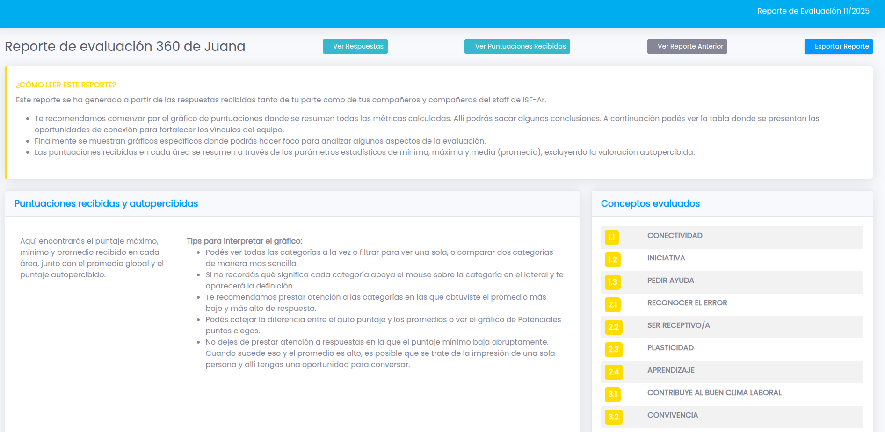
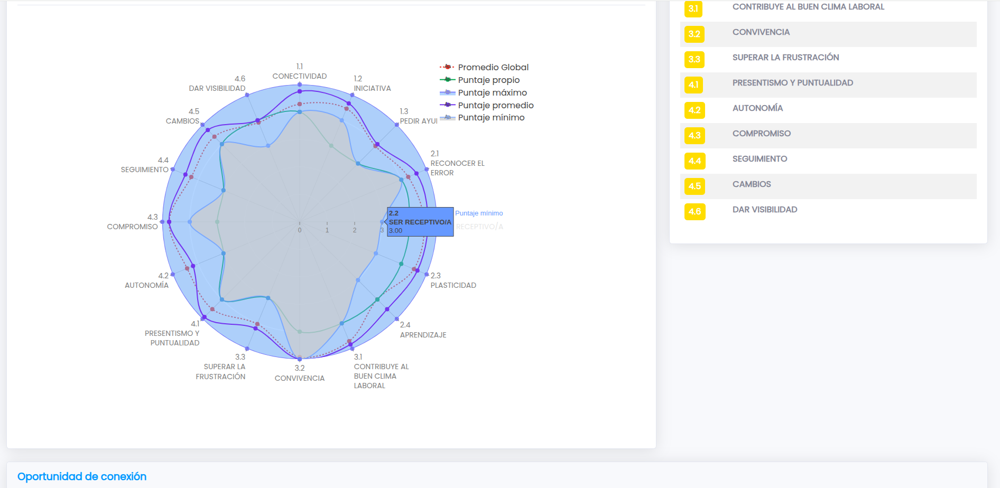
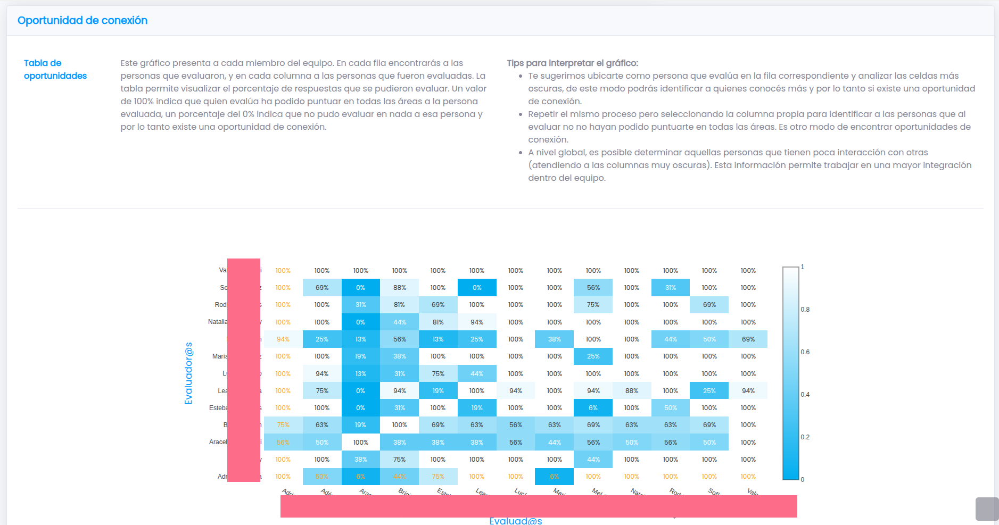
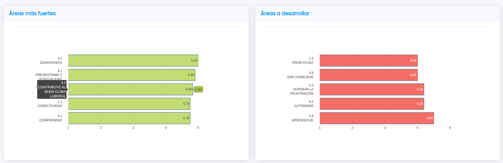
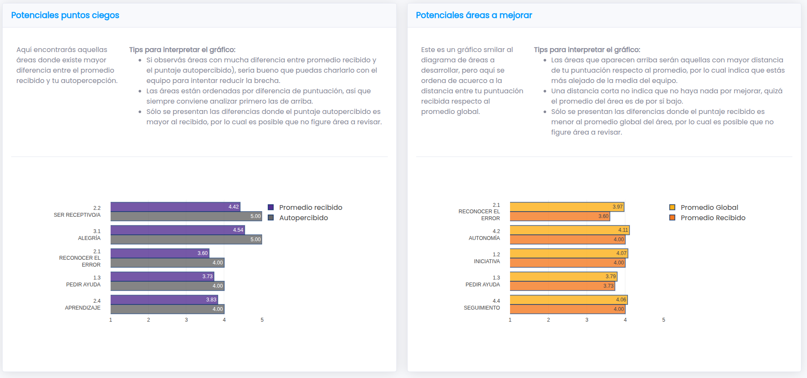

# 360 Feedback Report Generator

A self-hosted tool that collects peer-evaluation surveys via Google Forms and generates individual performance reports for each team member. Reports are rendered as interactive charts (radar, heatmap, bar charts) directly in the browser.

## Architecture

```
Google Sheet (users + Preguntas + Config)
    │
    ▼ Google Apps Script (google-form/google-form-generator.gs)
Google Form (survey)
    │
    ▼ Export CSV from Google Sheets
Admin Panel (/admin) — PHP
    │  • Validates CSV structure
    │  • Maps respondent names to question names
    │  • Computes scores (min/max/avg, global avg, connections)
    │  • Writes one JSON file per participant to data-users/
    │  • Sends notification emails via Google OAuth2
    │
    ▼ Static Report (/index.php?uid=<hash>)
Participant — views their own report in the browser
```

## Screenshots

**Report overview — intro card and competency legend**


**Radar chart — min, max, average, self-score, and global average per competency**


**Connection opportunity heatmap — % of questions each evaluator could score for each evaluatee**


**Strongest and development areas — top 5 by received average**


**Potential blind spots and areas to improve — self vs. received, and individual vs. team average**


> **Before publishing:** screenshots `report-overview.png` and `report-heatmap.png` contain real first names. Replace them with anonymized versions generated from a test dataset.

---

## Prerequisites

- Docker and Docker Compose
- A Google Cloud project with OAuth2 credentials configured for Gmail sending
- A Google Sheet with the following tabs:
  - **users** — one participant name per row in column A
  - **Preguntas** — competency definitions: column A = id (e.g. `1.1`), B = title, C = description
  - **Config** *(optional)* — row 1, column A = survey form title (defaults to `Encuesta 360`)

## Quick Start

**1. Clone and configure**

```bash
git clone <repo-url>
cd evaluacion-360
cp .env.example .env
```

Edit `.env` with your values (see [Environment variables](#environment-variables) below).

**2. Build and start**

```bash
docker compose build
docker compose up -d
```

The app will be available at `http://localhost:8088/evaluacion-360/`.

**3. Set up admin password**

Generate a bcrypt hash for your chosen admin password:

```bash
php -r "echo password_hash('yourpassword', PASSWORD_BCRYPT);"
```

Paste the output into `ADMIN_PASSWORD_HASH` in your `.env`, then restart:

```bash
docker compose restart
```

**4. (If needed) Refresh the Google OAuth token**

If email sending fails with an authentication error, renew the refresh token:

1. Visit `http://localhost:8088/evaluacion-360/admin/vendor/PHPMailer/get_oauth_token.php`
2. Follow the OAuth flow
3. Copy the new refresh token into `GOOGLE_REFRESH_TOKEN` in `.env`
4. Restart: `docker compose restart`

---

## Environment Variables

| Variable | Required | Description | Example |
|---|---|---|---|
| `APP_URL` | yes | Base URL of the app, no trailing slash | `https://your-domain.example.com/evaluacion-360` |
| `ORG_NAME` | yes | Organization name shown in the UI and emails | `Acme Corp` |
| `APP_HASH_SALT` | yes | Secret salt for report URL hashes — generate with `php -r "echo bin2hex(random_bytes(24));"` | `a3f9...` |
| `EMAIL_SENDER` | yes | Google account address used to send emails | `notifications@example.com` |
| `EMAIL_SENDER_NAME` | no | Display name in the From field (defaults to `ORG_NAME`) | `Acme Corp` |
| `GOOGLE_CLIENT_ID` | yes | OAuth2 client ID from Google Cloud Console | `xxxx.apps.googleusercontent.com` |
| `GOOGLE_CLIENT_SECRET` | yes | OAuth2 client secret | `GOCSPX-xxxx` |
| `GOOGLE_REFRESH_TOKEN` | yes | OAuth2 refresh token for the sender account | `1//xxxx` |
| `ADMIN_PASSWORD_HASH` | yes | Bcrypt hash of the admin panel password | `$2y$10$xxxx` |

---

## Google Apps Script Setup

1. Open your Google Sheet (with the `users`, `Preguntas`, and optionally `Config` tabs).
2. Go to **Extensions → Apps Script**.
3. Paste the contents of `google-form/google-form-generator.gs` into the editor and save.
4. Reload the spreadsheet — a new menu item **Iniciar Proceso → Crear nuevo Form** will appear.
5. Click it to generate the Google Form. The form will be linked to your spreadsheet for response collection.

**Sheet format**

- **users**: Column A — full name of each participant (one per row, no header).
- **Preguntas**: Column A — question id (integer for section headers, `X.Y` for scored items), B — title, C — description. The title must not contain `.`; the description must not contain `[` or `]`.
- **Config**: Column A, row 1 — the form title.

**Question id format:** `X.Y` where X is the category number and Y is the item number (e.g. `1.1`, `2.3`). Integer ids (e.g. `1`, `2`) are rendered as section headers in the form.

---

## Admin Panel Usage

Navigate to `/admin/` (you will be redirected to `/admin/login.php`).

**Workflow:**

1. **Export the Google Form responses** as CSV from Google Sheets (File → Download → CSV).
2. Click **Cargar Resultados** to upload the CSV.
3. In the **Asignación** table, verify that each respondent's registered name maps correctly to their name as it appears in the form questions. Adjust any mismatches using the dropdowns, then click **Actualizar Asignaciones**.
4. Check the validation message. If all checks pass, click **Generar reportes** in the left sidebar.
5. Select the participants to notify and click **Generar y enviar reportes**. Each participant receives an email with a link to their personal report.

---

## Report URL Security

Each participant's report is served at `/?uid=<hash>` where the hash is `SHA-256(rowid + month-year + APP_HASH_SALT)`. The salt makes the hashes unguessable even knowing the row position and the month. Reports for a given month become inaccessible once the salt changes or a new month's reports are generated.

---

## Security Notes

- The admin panel (`/admin/`) requires a password set via `ADMIN_PASSWORD_HASH`.
- All admin AJAX endpoints are session-guarded and validate a CSRF token.
- Participant data is stored as JSON files in `data-users/` (excluded from version control via `.gitignore`).
- Never commit your `.env` file — it contains credentials.
- Run the app behind a TLS-terminating reverse proxy (nginx, Caddy, etc.) in production.

---

## Contributing

Pull requests and issues are welcome. Please open an issue before submitting large changes.

## License

MIT
